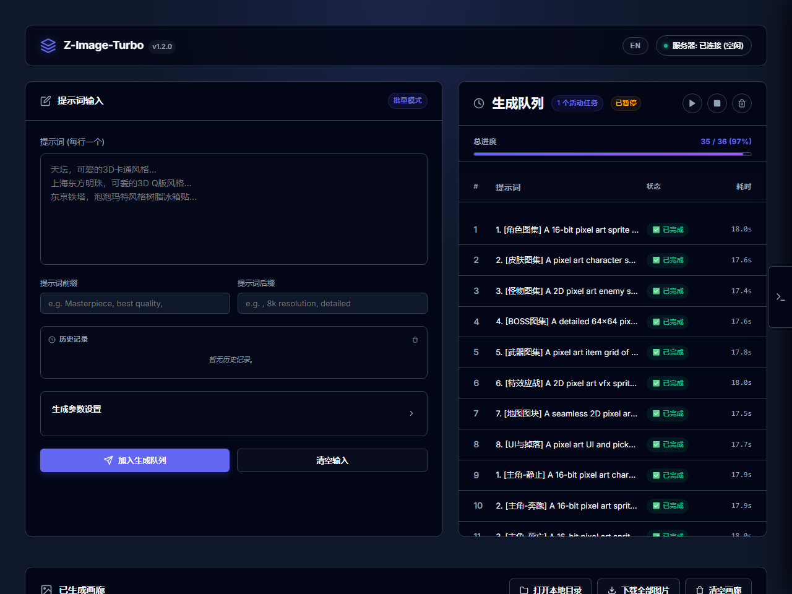

# Z-Image-Turbo Local Studio

本地 AI 生图工作台，基于 FastAPI 与网页前端，支持 Z-Image-Turbo 常驻加载、批量提示词队列、暂停/继续/停止、历史记录、参数调整和生成图片画廊。适合在消费级显卡上更稳定地进行本地批量出图。

- GitHub Repo: [holynova/image_local_llm](https://github.com/holynova/image_local_llm)
- GitHub Pages: [https://holynova.github.io/image_local_llm/](https://holynova.github.io/image_local_llm/)
- Cloudflare 静态预览: [https://image-local-llm.xiaosang.cc/](https://image-local-llm.xiaosang.cc/)

Cloudflare 发布 `static/` 中的前端页面；图像生成和队列接口依赖本地 Python/FastAPI、PyTorch 及模型环境，仍需在本地运行 `server.py`。
